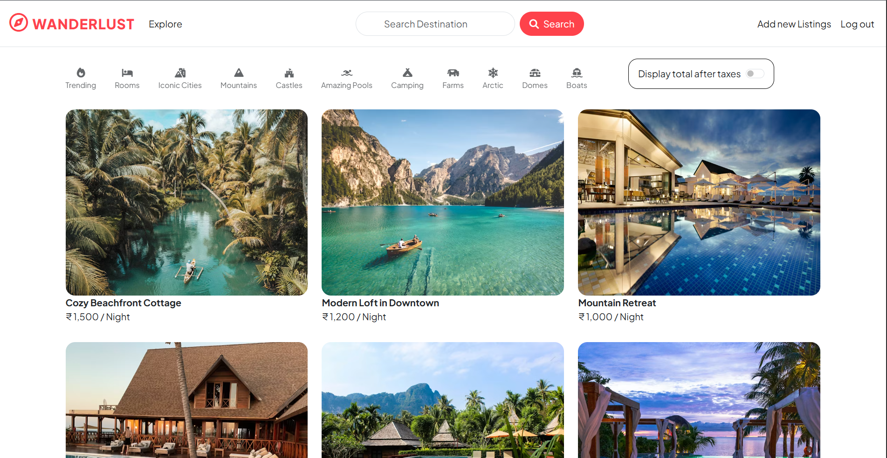
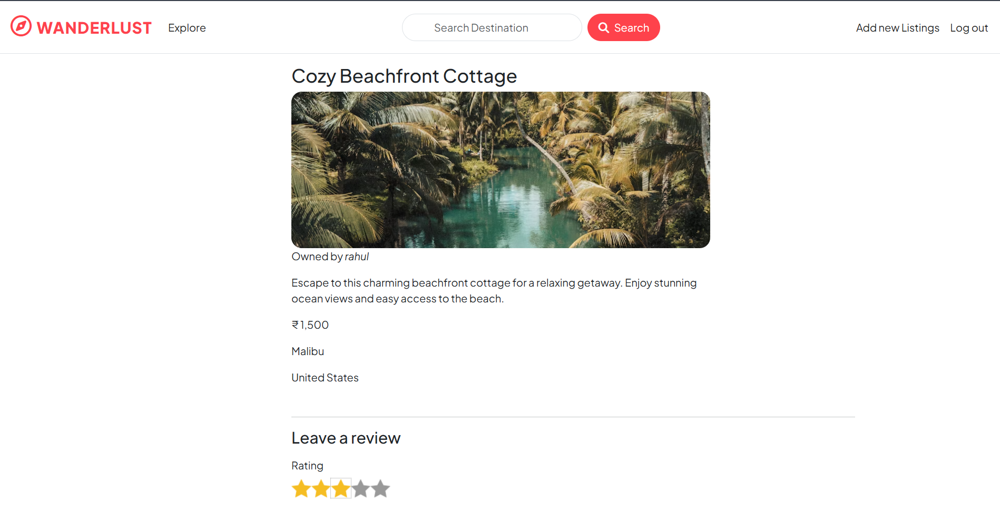
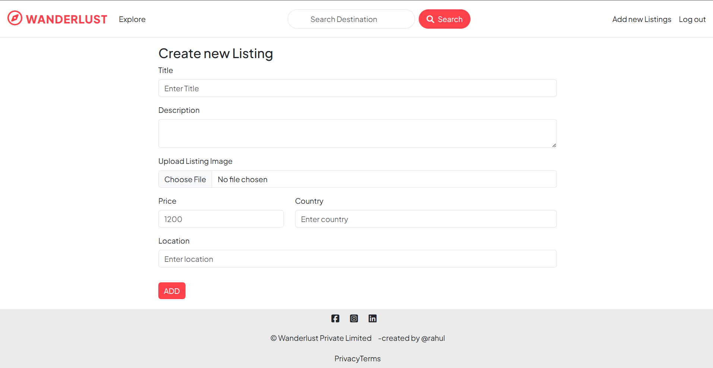

🌍 WanderLust – Travel Listing Web Application

A full-stack travel listing platform where users can explore, create, and manage travel destinations. Users can sign up, log in, add listings, upload images, and discover new places.


🚀 Features
🔐 User Authentication (Sign Up / Login / Logout)
🏝️ Create, Edit, and Delete Listings
🖼️ Image Upload using Cloudinary
🔍 Search Functionality for Listings
📱 Responsive UI with Bootstrap
⭐ Review and Rating System
☁️ MongoDB Atlas Database Integration


🛠️ Tech Stack

Frontend:
HTML
CSS
Bootstrap
EJS

Backend:
Node.js
Express.js

Database:
MongoDB
Mongoose

Other Tools:
Cloudinary (Image Storage)
Passport.js (Authentication)
Git & GitHub


📂 Project Structure
```text
WANDERLUST
│
├── controllers/        # Route logic and controller functions
├── init/               # Database initialization / seed data
├── models/             # Mongoose models
├── public/             # Static assets (CSS, JS, images)
├── routes/             # Express route files
├── utils/              # Utility functions and helpers
├── views/              # EJS templates (frontend)
│
├── .env                # Environment variables (not pushed to GitHub)
├── .gitignore          # Git ignored files
│
├── app.js              # Main Express application entry point
├── cloudConfig.js      # Cloudinary configuration
├── middleware.js       # Custom middleware functions
├── schema.js           # Joi validation schemas
│
├── package.json        # Project dependencies and scripts
├── package-lock.json   # Dependency lock file
└── README.md           # Project documentation
```

⚙️ Installation

Follow these steps to run the project locally.

1️⃣ Clone the repository
git clone https://github.com/Rahul-jain-coder/wanderlust.git

2️⃣ Navigate to the project folder
cd wanderlust

3️⃣ Install dependencies
npm install

4️⃣ Create .env file
Add the following variables:
ATLASDB_URL=your_mongodb_connection_string
CLOUDINARY_CLOUD_NAME=your_cloud_name
CLOUDINARY_KEY=your_key
CLOUDINARY_SECRET=your_secret
SESSION_SECRET=your_secret_key

5️⃣ Run the project
node app.js

Server will start at:
http://localhost:8080


📸 Screenshots
### Home Page

### Listing Details

### Add New Listing


🌐 Future Improvements
Add booking functionality
Add wishlist feature
Improve search filters
Add payment integration


🤝 Contributing
Contributions are welcome!

Fork the repository
Create a new branch
Commit your changes
Push to your branch
Open a Pull Request


👨‍💻 Author

Rahul Halvadiya
GitHub: https://github.com/Rahul-jain-coder
